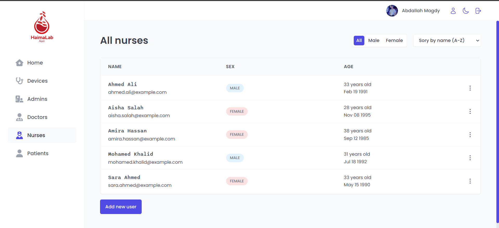

<div align="center">
  
</div>

# HaimaLab

Welcome to the HaimaLab project! This system aims to streamline and manage the operations of a medical hematology lab, providing various functionalities for different types of users. The system includes login capabilities, a dashboard for quick access to relevant information, and specific sections for patients, doctors, nurses, devices, and administrators.

## About

HaimaLab is designed to improve the efficiency and effectiveness of hematology lab operations. It allows authorized users to access and manage relevant data within the system, ensuring smooth workflows and accurate record keeping. This README file provides an overview of the system and its functionalities, installation instructions, and additional resources.

## Demo

Our web app is deployed to Vercel, you can try it with different roles and authorization levels on [haimalab.vercel.app](https://haimalab.vercel.app/).
Note: Data mutatuins (Creating, updating, deleting) are disabled in this demo version.

https://github.com/Bodykudo/HaimaLab/assets/83988379/633b7058-b603-41b1-928f-5edff3b39792

## Functionalities

HaimaLab offers the following functionalities:

1. _Login_: Users can securely log in to their respective accounts using their credentials.
   | User Login | Change Authorization level |
   | :----------------------------: |:----------------------------: |
   |  |  |

2. _Dashboard_: A central hub providing an overview of key information and quick access to different sections.
   | Dashboard | Dark Mode |
   | :----------------------------: |:----------------------------: |
   |  |  |

3. _Patients Section_: Admins can view and manage patient records, including personal details, medical history, and test results.
   | Patients | Add New Patient |
   | :----------------------------: |:----------------------------: |
   |  |  |

4. _Doctors Section_: Admins can add, edit, and delete doctor profiles, including their specialization and contact information.
   | Doctors | Add New Doctor |
   | :----------------------------: |:----------------------------: |
   |  |  |
5. _Nurses Section_: Admins can add, edit, and delete nurse profiles, including their assigned shifts and contact information.
   | Nurses | Add New Nurse |
   | :----------------------------: | :----------------------------: |
   |  |  |
6. _Devices Section_: Admins can view and manage the devices used in the medical lab, including maintenance schedules and availability.
   | Devices | Devies Extended |
   | :----------------------------: | :----------------------------: |
   |  |  |

   |        Add New Device        |        Edit Device        |
   | :--------------------------: | :-----------------------: |
   |  |  |

7. _Admins Section_: Only accessible to admin accounts, this section allows admins to view information about other user accounts without the ability to delete any user.
   | View Patient/Doctor/Nurse Profile | Edit Patient/Doctor/Nurse Profile |
   | :----------------------------: | :----------------------------: |
   |  |  |

8. _Profile Section_: Any Admin/Patient/Doctor/Nurse can edit his profile, including their Name, Birthdate, Mobile and avatar.

   |        Profile         |    Profile Extended    | Edit Profile               |
   | :--------------------: | :--------------------: | -------------------------- |
   |  |  |  |

## Installation

To install and run the HaimaLab locally, follow these steps:

1. Clone the project repository.
2. Navigate to the project directory.
3. Install the necessary dependencies by running the following command:

```
npm install
```

4. Run the project by running the following command:

```
npm run dev
```

5. Access the system by visintg http://127.0.0.1:5173

## Technology Stack

Built using React, React Query, Supabase and Styled Components

<p align="left"> <a href="https://html.spec.whatwg.org/multipage/" target="_blank" rel="noreferrer">  </a>
  <a href="https://www.w3schools.com/css/" target="_blank" rel="noreferrer">  </a> <a href="https://developer.mozilla.org/en-US/docs/Web/JavaScript" target="_blank" rel="noreferrer">  </a> <a href="https://reactjs.org/" target="_blank" rel="noreferrer">  </a>
    <a href="https://supabase.com/" target="_blank" rel="noreferrer">  </a>
  <a href="https://platform.openai.com/docs/api-reference" target="_blank" rel="noreferrer">  </a>
  <a href="https://git-scm.com/" target="_blank" rel="noreferrer">  </a>
</p>

We would like to acknowledge the following individuals for their contributions to the HaimaLab project:

<table>
  <tr>
    <td align="center">
    <a href="https://github.com/Bodykudo" target="_black">
    
    <br />
    <sub><b>Abdallah Magdy</b></sub></a>
    <td align="center">
    <a href="https://github.com/abduelrahmanemad" target="_black">
    
    <br />
    <sub><b>Abdelrahman Emad</b></sub></a>
    </td>
    </td>
    <td align="center">
    <a href="https://github.com/MohamedAlaaAli" target="_black">
    
    <br />
    <sub><b>Mohamed Alaa</b></sub></a>
    </td>
    <td align="center">
    <a href="https://github.com/OmarAtef0" target="_black">
    
    <br />
    <sub><b>Omar Atef</b></sub></a>
    </td>
   <td align="">
    <a href="https://github.com/ossama971" target="_black">
    
    <br />
    <sub><b>Osama Mohamed Badawi</b></sub></a>
    </td>
    <td align="center">
    <a href="https://github.com/Youssef-Ashraf71" target="_black">
    
    <br />
    <sub><b>Youssef Ashraf</b></sub></a>
    </td>
      </tr>
 </table>
